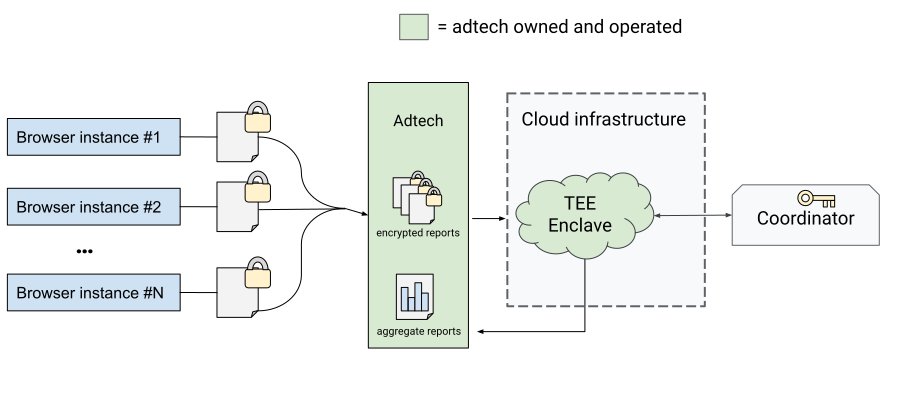

# Aggregation Service for the Attribution Reporting API

## Authors
* Carlos Cela (cjcela@google.com)
* Ruchi Lohani (rlohani@google.com)
* Martin Pál (mpal@google.com)
* Chanda Patel (chandapatel@google.com)

## Introduction

The Attribution Reporting API is designed to provide two types of reports: an
"event-level report," which corresponds to a single attributed event, and a
summary report. Summary reports can be used to provide aggregated statistics
from Attribution Reporting API events in the client software, such as a
[Chrome browser](https://github.com/WICG/conversion-measurement-api/blob/main/AGGREGATE.md)
or an [Android device](https://developer.android.com/design-for-safety/ads/attribution). 

In this document, you'll find the proposed server-side mechanisms for the aggregation
service, which allows adtechs to create summary reports.

* [Proposed design principles](#proposed-design-principles)
* [Key terms](#key-terms)
* [Aggregation workflow](#aggregation-workflow)
* [Security considerations](#security-considerations)
* [Privacy considerations](#privacy-considerations)
* [Mechanics of aggregation](#mechanics-of-aggregation)
* [Initial experiment plans](#initial-experiment-plans)
* [Open questions](#open-questions)

_Note that this is an explainer, the first step in the standardization process. The aggregation service is not finalized. The service as described (including report metrics, privacy mechanisms, and method of execution) is subject to change as we incorporate ecosystem feedback and iterate._


## Proposed design principles

The aggregation service for the Attribution Reporting API intends to meet a set
of [privacy and security goals](https://github.com/WICG/conversion-measurement-api/blob/main/AGGREGATE.md#privacy-considerations)
through technical measures. This includes:


1. Uphold The Privacy Sandbox design goals for privacy protections in 
   Attribution Reporting. Specifically, we intend to provide appropriate
   infrastructure for noise addition and aggregation, aligned with the
   long-term goal of differential privacy.
1. Prevent inappropriate access to raw attributed conversion data or other
   intermediate data through technical enforcement.
1. Allow adtechs to retain control over the data they've collected and access
   noisy aggregated data without sharing their data with any third party. 
1. Support flexible, scalable, and extensible aggregation strategies and
   on-demand access to the aggregation infrastructure, so that adtechs
   can choose when and how often to generate summary reports.
1. Provide open and transparent implementations for any infrastructure outside
   of the client. 

## Key terms

Before reading this explainer, it will be helpful to familiarize yourself with key
terms and concepts. These have been ordered non-alphabetically to build knowledge
based on previous terms. All of these terms will be reintroduced and further described
throughout this proposal.

* _Adtech_: a company that provides services to deliver ads. This term is used to
  generally describe companies who are most likely to use the aggregation service.
* _Client software:_ shorthand for the implementation of the Attribution Reporting
  API on a browser or device (such as a
  [Chrome browser](https://github.com/WICG/conversion-measurement-api/blob/main/AGGREGATE.md)
  or an [Android device](https://developer.android.com/design-for-safety/ads/attribution)).
* _Aggregatable reports_: encrypted reports sent from individual user devices which
  contain data about individual conversions. Conversions (sometimes called
  _attribution trigger events_) and associated metrics are defined by the advertiser or adtech.
  [Learn more about aggregatable reports](https://github.com/WICG/conversion-measurement-api/blob/main/AGGREGATE.md).
* _Aggregation service (this proposal)_: an adtech-operated service that processes
  data from aggregatable reports to create a summary report.
* _Summary reports_: the result of noisy aggregation applied to a batch of aggregatable
  reports. Summary reports allow for greater flexibility and a richer data model than
  event-level reporting, particularly for some use-cases like conversion values. 
* _Reporting origin_: the entity that receives aggregatable reports–in other words,
  the adtech that called the Attribution Reporting API. Aggregatable reports are sent
  from user devices to a [well-known URL](https://datatracker.ietf.org/doc/html/rfc5785)
  associated with the reporting [origin](https://developer.mozilla.org/en-US/docs/Glossary/Origin).
* _Contribution bounding_: aggregatable reports may contain an arbitrary number of
  counter increments. For example, a report may contain a count of products that a user
  has viewed on an advertiser's site. The sum of increments in all aggregatable reports
  related to a single source event must not exceed a given limit, `L1=2^16`.
  [Learn more in the aggregatable reports explainer](https://github.com/WICG/conversion-measurement-api/blob/main/AGGREGATE.md#contribution-bounding-and-budgeting).
* _Attestation_: a mechanism to authenticate software identity, usually with
  [cryptographic hashes](https://en.wikipedia.org/wiki/Cryptographic_hash_function)
  or signatures. In this proposal, attestation matches the code running in the
  adtech-operated aggregation service with the open source code.
* _Trusted Execution Environment (TEE)_: a dedicated, closed execution context that is
  isolated through hardware memory protection and cryptographic protection of storage. The
  TEE's contents are protected from observation and tampering by unauthorized parties,
  including the root user.
* _Key management service_: a centralized component tasked with provision of decryption
  keys to appropriately secured aggregation server instances. Provision of public encryption
  keys to end user devices and key rotation also fall under key management.
* _Coordinator:_ an entity responsible for key management and aggregatable report
  accounting. The coordinator maintains a list of hashes of approved aggregation
  service configurations and configures access to decryption keys.
* _Shared ID:_ A unique identifier assigned to a group of reports in combination with [filtering IDs](https://github.com/patcg-individual-drafts/private-aggregation-api/blob/main/flexible_filtering.md#proposal-filtering-id-in-the-encrypted-payload) to prevent overlap between batches of reports. This eliminates the need to track individual reports and allows for efficient privacy budget management at the group level. 

## Aggregation workflow

Adtechs use the aggregation service to generate summary reports, which offer detailed
conversion data (such as purchase values and cart contents) and flexibility for click
and view data. The overall aggregation workflow is as follows:

1. An aggregatable report is generated on client software (such as the
   [Chrome browser](https://github.com/WICG/conversion-measurement-api/blob/main/AGGREGATE.md#aggregatable-reports)
   or [Android device](https://developer.android.com/design-for-safety/ads/attribution)).
   The client software encrypts the contents of the report and sends it
   to the adtech's reporting origin.
1. The adtech collects aggregatable reports and assembles them
   [into batches](#disjoint-batches) (for example, all the reports generated for
   a given advertiser on a given date).
1. The adtech sends a batch of reports for aggregation to its aggregation service.
1. To access decrypted versions of the reports, the adtech-operated aggregation
   service runs an approved version of the aggregation logic in a Trusted
   Execution Environment (TEE). Decryption keys will only be released to
   TEEs running an approved version of the aggregation logic.
1. The aggregation service decrypts and aggregates the batched aggregatable
   reports to generate a summary report.
1. The summary report is released from the aggregation service, to be used by
   the adtech.



 _Multiple clients encrypt aggregatable reports and send the reports to an
 adtech-owned reporting origin. The adtech's aggregation service transforms
 this data into a summary report._

## Security considerations

The aggregation service design outlined in this proposal uses a combination
of TEEs and attestation to an independent coordinator to ensure that all data
remains secure. 

* Decryption and aggregation of raw aggregatable report data happens within a
  secure and isolated Trusted Execution Environment. This prevents adtech from
  accessing the decrypted inputs, intermediate data, and the decryption key.
* Attestation ensures that an adtech-operated aggregation service runs an
  approved codebase and can access the decryption keys needed to decrypt and
  aggregate data.
    * Splitting decryption keys among multiple coordinators increases the
      difficulty of compromising this trust model.
* Open source implementations of the aggregation service and coordinator logic
  ensure that these systems are publicly accessible and can be inspected by a
  broad set of stakeholders.

### Trusted Execution Environment

A Trusted Execution Environment (TEE) is a combination of hardware and software
mechanisms that allows for code to execute in isolation, not observable by any
other process regardless of the credentials used. The code running in TEE will
be open sourced and audited to ensure proper operation. Only TEE instances running
an approved version of the aggregation code can access decryption keys.

The code running within a TEE performs the following tasks:

* Parse batches of aggregatable reports, decrypt, and aggregate them
* Add noise to the aggregates and output a summary report for each batch processed
* Handle error reporting, logging, crashes and stack traces, access to external
  storage and network requests in a way that aids usability and troubleshooting
  while protecting raw and intermediate data at all times.

Adtechs will operate their own TEE-based aggregation service deployment. Adtechs
will also control the collection and storage of requested aggregatable reports,
as well as storage and usage of summary reports produced via aggregation. The TEE
ensures that the adtech cannot decrypt the aggregatable reports or access any
intermediate data.

### Attestation and the coordinator

The code running within the TEE is the only place in the system where raw reports
from client software can be decrypted. The code will be open sourced so it can be
audited by security researchers, privacy advocates, and adtechs.

Google will periodically release binary images of the aggregation server code for
TEE deployment. A cryptographic hash of the build product (the image to be deployed
on the TEE) is obtained as part of the build process. The build is reproducible so
that anyone can build binaries from source and verify they are identical to the
images released by Google.

The coordinator has several responsibilities, including: maintain and publish a
list of hashes of the authorized binary images, operate shared key services, and
operate a tracking system for aggregatable event metadata processing.

When a new approved version of the aggregation service binary is released, the
coordinator will add the new version to its list of authorized images. If an image
is found in retrospect to contain a critical security or functional flaw, it can be
removed from the list. Images older than a certain age will also be periodically
retired from the list.

The coordinator operates the key management system. Encryption keys are necessary for
the client software to fetch and encrypt aggregatable reports. The encryption keys are
public. Decryption keys are required for the aggregation service to process the data
from the aggregatable reports. The decryption keys are released only to TEE images
whose cryptographic hash matches one of the images on the authorized images list.

The coordinator operates a system that records metadata about processed aggregatable
events (these events encapsulate the user action which lead to aggregatable reports).
This is instrumental in preventing aggregatable reports from being reused in multiple
batches to craft summary reports which may reveal PII.

## Privacy considerations

In the proposed architecture for the Attribution Reporting API, logic in the client
software and server work together to keep data private and secure. 

When a summary report is released, the adtech learns some information about users
whose contributions are included in the summary report. A goal for this system is
to provide a framework that supports
[differential privacy](https://en.wikipedia.org/wiki/Differential_privacy) (DP),
as such we use tools and mechanisms to quantify and limit the amount of
information revealed about any individual user. 

### Added noise to summary reports

The aggregation service uses an [additive noise
mechanism](https://en.wikipedia.org/wiki/Additive_noise_mechanisms). This means
that a certain amount of statistical noise is added to each aggregate value
before its release in a summary report. 

We propose to add noise drawn from a discrete version of the [Laplace
distribution](https://en.wikipedia.org/wiki/Laplace_distribution), scaled based on
the `L1` sensitivity, which is enforced by the client (known as [contribution
bounding](#contribution bounding)) (`2^16`) and a desired privacy parameter
`epsilon`.

### Contribution bounding

The client API [limits the magnitude of
contributions](https://github.com/WICG/conversion-measurement-api/blob/main/AGGREGATE.md#contribution-bounding-and-budgeting)
from aggregatable reports linked to a single source event. This design
provides a proper foundation to control the sensitivity of summary reports,
which is critical for calibration of the amount of noise to add. Sensitivity
is reflected in the amount a summary report could change if any given
aggregatable report were removed from the process.

### "No duplicates" rule

To gain insight into the contents of a specific aggregatable report, an
attacker might make multiple copies of it, and include the copies in a
single aggregation batch (as duplicates) or in multiple batches. Because
of this, the aggregation service enforces a "no duplicates" rule:

* No aggregatable report can appear more than once within a batch. 
* No Shared ID can appear in more than one batch or contribute
  to more than one summary report. 

The no-duplicates rule is enforced during aggregation. If duplicates are
found, these batches may be rejected or duplicates may be filtered out.

#### Disjoint batches

It is not technically practical to keep track of every single aggregatable
report submitted for aggregation to check for batch disjointness, that is,
that batches are not overlapping. Instead, each aggregatable report will
be assigned a shared ID. This ID is generated from the combined data points: API version, reporting origin, destination site, source registration time, scheduled report time, and filtering ID. 
These data points come from the report's [shared_info](https://github.com/WICG/attribution-reporting-api/blob/main/AGGREGATE.md#aggregatable-reports) field and from the job parameter in the request. 

The aggregation service will enforce that all aggregatable reports with
the same ID must be included in the same batch. Conversely, if more than
one batch is submitted with the same ID, only one batch will be accepted
for aggregation and the others will be rejected.

#### Pre-declaring aggregation buckets 

The Attribution Reporting API client describes a [128 bit key
space](https://en.wikipedia.org/wiki/Key_size) for assigning aggregation
"buckets". This large space gives adtechs flexibility in how they define
and use aggregated metrics. At this size, it's infeasible for the
aggregation service to output a value for every possible bucket. Therefore,
adtechs will need to declare a select set of buckets to be included in the
collected data. 

Only buckets which are pre-declared will be considered in aggregation.
This ensures the aggregation service doesn't exceed reasonable storage
capacity.

The aggregated value for each bucket is output with addition of
statistical noise. If a bucket is pre-declared but not present in
any input aggregatable report, a value is still output, drawn from
the same statistical noise distribution.

Other models, such as outputting buckets and values if the value
exceeds a noisy threshold may be considered in future iterations.

## Mechanics of aggregation

### Reporting origin

Before adtechs can generate summary reports with the aggregation
service, they must first collect the aggregatable reports from user
devices. The reporting origin (or collector server) is owned by
the adtech. 

Adtechs must then batch the aggregatable reports on a reliable
storage server. Once batched, the adtech sends a request to the
aggregation service to process the batched reports.

### Aggregatable reports

The encrypted payload of an aggregatable report is a [list of key-value
pairs](https://github.com/WICG/conversion-measurement-api/blob/main/AGGREGATE.md#encrypted-payload).
The keys are 128 bit "bucket labels", and the values are positive
integers.

For example:

```
"report": [{"bucket": <bucket>, "value": <value> }, ...]
```

### Summary report

The summary report is a list JSON-formatted, dictionary-style set of
key-value pairs. This means each key-value pair should appear only once.

For each bucket, the summary report contains the sum of values from
all aggregatable reports in the input. The core aggregation logic is
represented by the following snippet of Python pseudo code.

```python
# Input: a list of aggregatable reports. Each aggregatable report is a dictionary.
# Output: a raw summary report, which is also a dictionary.
def aggregate(aggregatable_reports):
  raw_summary_report = {}
  for agg_report in aggregatable_reports:
    for bucket_label, value in agg_report:
      raw_summary_report[bucket_label] = \
          raw_summary_report.get(bucket_label, 0) + value
  return raw_summary_report
```

### Added noise

We will never return the raw summary report. Instead, we'll add
noise to each value to preserve privacy.

However, if we added noise to every possible `bucket_label`, even if
the vast majority of labels never appear in the input, the output
would be astronomically large (2^128 entries!). To work around this
problem, we require adtech to [pre-declare aggregation buckets](#pre-declaring-aggregation-buckets).

```python
# Input: a raw summary report (a dictionary)
# Output: a noised report (a dictionary containing all the keys in declared_labels)
def add_noise(raw_summary_report, declared_labels):
  noised_summary_report = {}
  for bucket_label in declared_labels:  
    noised_summary_report[bucket_label] =  \
    raw_summary_report.get(bucket_label, 0) + generateNoise()
  return noised_summary_report
```

## Initial experiment plans

The initial implementation strategy for the aggregation service is as follows:


* The TEE based aggregation service implementation would be deployed
  on cloud service(s) which support needed security features.  We
  envision the aggregation service being capable of being deployed with
  multiple cloud providers. See the [Public Cloud TEE requirements explainer](https://github.com/privacysandbox/protected-auction-services-docs/blob/main/public_cloud_tees.md) for more details.
  * Currently the aggregation service can be deployed on Amazon Web Services
    (AWS) and Google Cloud Platform (GCP). We expect to support more cloud
    providers in the future.
* In our current implementation, batches can be assembled on any
  reliable storage service. However, batches will need to be uploaded
  to the cloud provider to be processed by the aggregation service.
* To make testing of the aggregation service available in an origin
  trial, Google will play the role of coordinator. Longer term, we
  prefer that one or more independent entities can assume this role. 
* During the initial experiment, we expect that adtechs will be able
  to access decrypted payloads via a debugging mode tied to the
  availability of third party cookies.
* During the third-party cookie deprecation, the aggregation service will support a range of epsilon values up to 64. This allows adtechs to experiment with different aggregation strategies and provide feedback on the utility of the system with different privacy parameters. We will provide advanced notice to the ecosystem before the epsilon range values are updated.

## How this proposal addresses our design goals

We started this proposal with a list of [proposed design
principles](#proposed-design-principles). Here's a summary of how we
addressed each goal in the proposal:

* Our proposal lays a foundation to meet our goal of differential
  privacy through a number of mechanisms (such as additive noise)
  (goal 1). There is more work to be done, and there are many
  [open questions](#open-questions) related to improved mechanisms and
  more nuanced privacy accounting.
* By choosing Trusted Execution Environments for the initial
  infrastructure, we're balancing the need to prevent inappropriate
  access to raw or intermediate data (goal 2) with allowing adtechs
  to retain control and ownership of their data (goal 3). This also
  supports flexible development with scalable, on-demand access to the
  aggregation service, so that adtechs can process data when it is most
  convenient for them (goal 4).
* The aggregatable reports are encrypted on the user's device, so we
  must ensure these reports are never accessible in a decrypted format
  to any party (including the adtech which collected this data). The
  aggregation logic, along with the coordinator and attestation process,
  meet this need (goal 3).
* We intend to open source all code for the aggregation service. This
  promotes transparency and openness both in implementation and generation
  of new ideas for all parts of this service (goal 5). Open source
  implementations also provide an opportunity for validation by outside
  parties.

## Open questions

This explainer is the first step in the standardization process followed
by The Privacy Sandbox proposals. The aggregation service is not
finalized, and we expect that it will benefit greatly from feedback from
the community. There are many ways to provide feedback on this proposal
and participate in ongoing discussions, which includes commenting on the
Issues below, [opening new Issues in this
repository](https://github.com/WICG/conversion-measurement-api/issues),
or attending a [WICG Measurement meeting](https://github.com/WICG/conversion-measurement-api/tree/main/meetings).
We intend to incorporate and iterate based on feedback.

1. Who reviews and validates the open source code? What is the right
   contribution and approval model? 
   [issues/322](https://github.com/WICG/conversion-measurement-api/issues/322)
1. Who are appropriate parties to serve as coordinators?
   [issues/323](https://github.com/WICG/conversion-measurement-api/issues/323)
1. What is the right way to support debugging or error investigations
   without compromising the security of the system? 
   [issues/324](https://github.com/WICG/conversion-measurement-api/issues/324)
1. How can adtechs recover from failures (such as a misconfigured batch)?
   [issues/325](https://github.com/WICG/conversion-measurement-api/issues/325)
1. This proposal requires that the adtech works with a cloud provider
   with specific TEE capabilities. How do we balance the security needs
   of the system with the costs and implementation effort? 
   [issues/326](https://github.com/WICG/conversion-measurement-api/issues/326)
1. Our proposal includes one specific aggregation mechanism. There are
   many alternative, differentially private mechanisms that could support
   specific use cases or provide better quality results. How can we best
   build the system so it can support a wide range of use cases? 
   [issues/327](https://github.com/WICG/conversion-measurement-api/issues/327)
1. How should proposed extensions be evaluated for privacy, security and
   utility to be included in the aggregation service?
   [issues/328](https://github.com/WICG/conversion-measurement-api/issues/328)
1. Are there any other approaches to the security architecture that could
   work here? For example, multi-party computation (MPC) is an interesting
   approach that can be complementary.
   [issues/330](https://github.com/WICG/conversion-measurement-api/issues/330)
