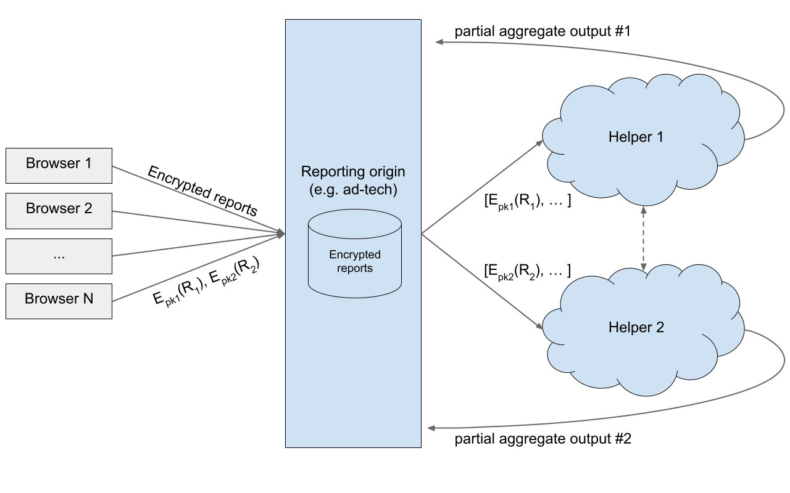

# **Multi-Browser Aggregation Service Explainer**

# Introduction

This document is an explainer for a generic mechanism for sites to receive privacy-safe data and analytics, aggregated across many browser instances.

This information channel could be used by new web platform APIs that wish to expose some amount of cross-site data (e.g. conversion measurement) in a privacy-safe way without using persistent tracking IDs like third party cookies.

## Authors

- csharrison@chromium.org
- marianar@google.com
- kleber@google.com
- johnidel@chromium.org
- ammedina@google.com

<!-- START doctoc generated TOC please keep comment here to allow auto update -->
<!-- DON'T EDIT THIS SECTION, INSTEAD RE-RUN doctoc TO UPDATE -->
## Table of Contents

- [Introduction](#introduction)
- [High level goals](#high-level-goals)
- [Basic outline](#basic-outline)
  - [Input](#input)
  - [Intermediate, unreadable output](#intermediate-unreadable-output)
  - [Final, private output](#final-private-output)
  - [Extensions](#extensions)
    - [Grouping multiple keys in one query](#grouping-multiple-keys-in-one-query)
    - [Sharding keys](#sharding-keys)
    - [Authenticating inputs](#authenticating-inputs)
    - [Total unique user counts](#total-unique-user-counts)
- [Privacy considerations](#privacy-considerations)
  - [Secure multi-party computation protocol](#secure-multi-party-computation-protocol)
  - [Differential privacy (DP)](#differential-privacy-dp)
  - [Record level, user level DP and Epsilon Budget](#record-level-user-level-dp-and-epsilon-budget)
  - [Enforcing per-record query limits](#enforcing-per-record-query-limits)
  - [DP in the face of an unknown output domain](#dp-in-the-face-of-an-unknown-output-domain)
- [Security considerations](#security-considerations)
  - [Who runs the helper servers?](#who-runs-the-helper-servers)
    - [More than 2 helpers](#more-than-2-helpers)
  - [Protection from helpers that intend to modify output](#protection-from-helpers-that-intend-to-modify-output)
- [Alternative Mechanisms Being Explored](#alternative-mechanisms-being-explored)
  - [Relying on a single trusted helper](#relying-on-a-single-trusted-helper)
  - [Secure Aggregation](#secure-aggregation)
  - [Local Differential Privacy](#local-differential-privacy)
  - [Privacy measures besides Differential Privacy](#privacy-measures-besides-differential-privacy)
  - [Sending data directly to the helper servers](#sending-data-directly-to-the-helper-servers)
- [Appendix](#appendix)
  - [Differentially private noise example](#differentially-private-noise-example)
- [References & acknowledgements](#references--acknowledgements)

<!-- END doctoc generated TOC please keep comment here to allow auto update -->

# High level goals

*   This mechanism should enable computations at aggregate levels but at the same time protect any individual level data.
*   Any additional server infrastructure used to facilitate the aggregation of reports across browsers on behalf of reporting origins should be minimally trusted by the parties in the reporting process.
*   The privacy preserving mechanism should minimize trust assumptions for the consumer of the output.
*   We aim to provide formal privacy analysis that the mechanism achieves the above privacy goals. Some examples of privacy guarantees relevant for this task could be differential privacy and secure multiparty computation.

Examples of use-cases that could be covered with a mechanism like this is a conversion measurement API, or a generic [aggregate reporting API](https://github.com/csharrison/aggregate-reporting-api) for things like ad reach measurement.


# Basic outline

The service is built around two semi-trusted auxiliary helper servers that perform centralized aggregation on encrypted data: Neither helper alone can read the data, and they are primarily trusted to not collude with each other.  This design was inspired by [Firefox and Prio](https://firefox-source-docs.mozilla.org/toolkit/components/telemetry/collection/origin.html).

A reporting origin that wishes to learn aggregate, cross-site information receives encrypted reports from multiple browsers (which the reporting origin cannot read). After receiving the encrypted reports, the reporting origin can use the encrypted reports to interact directly with the helper servers to learn the private aggregate results for their data. Consumers of this service’s output (i.e the reporting origin) might include ad-tech, analytics, and other companies with similar use cases.



This is an additive proposal designed to support aggregate reporting use cases such as the [aggregate conversion measurement API](AGGREGATE.md).

## Input

The precise input to this mechanism will be domain specific, based on which web platform APIs make use of this data. However, we need constraints on the data to be able to describe generic aggregation mechanisms.

The core piece of input data here is called a RawAggregateReport. This report is scoped to a particular reporting origin and could contain something like the following example:


```
{
  aggregation_key: <string>
  value: <integer>
}
```


**Note**: the RawAggregateReport is something that is only known by the browser and doesn’t actually get sent anywhere in this form. You can think of this as being a “cleartext” row of the data that is stored in a distributed manner at the helper servers who are aggregating without being able to see individual rows.

**Note**: to aid in the two-helper protocol, and to satisfy privacy requirements, it is beneficial for the domain of the value to be some bounded integer range like [0, 65535].

Some applications may want more flexibility on the input domain, this is just a starting point. In particular, the aggregation key could be created from multiple pieces, generated on different reporting origins. A canonical example is impression and conversion data necessary for attributed conversion measurement.


```
{
  aggregation_key: ["campaign=12", "conv-type=purchase"],
  value: 123
}
```


In general, the RawAggregateReport is something that the browser generates, based in part by input from any underlying API like a conversion API.


## Intermediate, unreadable output

Once a particular web platform API creates a RawAggregateReport, it can be scheduled to be sent to its associated reporting origin. To do this, the browser packages the report into two encrypted pieces, called "shares", one intended for each helper server. These pieces are then sent directly to the reporting origin in an uncredentialed (e.g. cookieless) request. However, because the payloads are encrypted with the helper servers' keys, the reporting origin cannot read them unless it interacts with the helper servers. Call this structure an EncryptedAggregateReport:


```
{
  api_identifier: "conversion_measurement",
  report_share_1: {
    helper_1_endpoint: <URL>,
    payload: <encrypted payload for helper 1>
  },
  report_share_2: {
    helper_2_endpoint: <URL>,
    payload: <encrypted payload for helper 2>
  }
}
```


The reporting origin should collect and store these reports as they come in.


## Final, private output

Once the reporting origin has many reports (e.g. they have collected them for a few days), they invoke a protocol with the two helpers, sending each helper a batch of report shares.  The helpers perform some computation, which may include communicating with one another. This computation also includes applying some privacy mechanism to ensure the final output is private. At the end of the protocol each helper server returns partial results which can be combined together to learn the joint output.

For example, if the privacy mechanism we choose achieves [differential privacy](#differential-privacy-dp), the result from each helper may output data with small amounts of noise applied, and with some keys (potentially) dropped if they do not have counts above some threshold (see the section [Alternative Mechanisms Being Explored](#alternative-mechanisms-being-explored) for more information about different potential approaches). Here is a concrete example using the RawAggregateReport from the previous section:


```
<AggregationKeyID>: {
  aggregation_key_share: <num>,
  total_count_share: <num>,
  total_count_noise: {
    distribution: "laplace",
    std: <num>
  },
  sum_value_share: <num>,
  sum_value_noise: {
    distribution: "laplace",
    std: <num>
  },
}
```


Each individual share doesn't reveal anything about the data associated with the aggregation key, but combining shares from each helper recovers the total values. In the end, the reporting origin can derive the following data:


```
<AggregationKeyID>: {
  aggregation_key: <string>,

  // The number of reports with this aggregation key
  total_count: <sum(count)>,

  // Both helpers should use the same noise params.
  total_count_noise: {...},

  // The sum of the value in each report with this aggregation key
  sum_value: <sum(value)>,
  sum_value_noise: {...}
}
```


End users of the data can use the reported noise distribution and standard deviation to learn how accurate the data is (i.e. generate plots with error bars).

The reporting origin may then store the private aggregate output, e.g in databases, to support more traditional computational analysis. Additionally the reporting origin may choose to store the encrypted reports for longer periods of time to perform new aggregation queries (see
[Grouping multiple keys in one query](#grouping-multiple-keys-in-one-query) in Extensions below) across the encrypted data. Limits will need to be applied on the number of times a report can be included in the aggregation query requests in order to preserve privacy (see
[Enforcing per-record query limits](#enforcing-per-record-query-limits) in the Privacy Considerations section below).


## Extensions


### Grouping multiple keys in one query

The proposal as described above allows for querying fixed aggregation keys that are specified in advance, in the browser during AggregateReport creation. It’s possible to make the querying of aggregation keys more flexible, where the aggregation grouping may not be known _a priori_. For example, a query to the helper servers could, in addition to the encrypted reports to aggregate, include a list of (also encrypted) aggregation keys to aggregate together:


```
[
  "Query1": {
    aggregation_keys: [<key1>, <key2>, ...]
  },
  "Query2": {
    aggregation_keys: [<key3>, <key4>, ...]
  }, ...
]
```


The output from the helpers to the reporting origin could then look like, for every query:


```
 <QueryID>: {
  count_share: <num>,
  count_noise_std: <num>,
  value_share: <num>,
  value_noise_std: <num>
}
```


You can imagine this general approach being used to form aggregation keys that are much finer grained, for the explicit purpose of combining together after the fact.  In this scenario, aggregating each key individually might not be feasible, because the aggregates for keys appearing in few reports would either be dropped or would have too much noise to be useful.


### Sharding keys

Another technique to form more complex queries is to give structure to the declared aggregation keys. For example, the key “campaign=12,conv-type=3” could be split into two keys “campaign=12”, and “conv-type=3”.  You could imagine adding support for something like the following SQL query:


```
SELECT COUNT(*)
FROM reports
WHERE key1 = "campaign=12" AND key2 = "conv-type=3"
```


### Authenticating inputs


In today's world, it is possible to authenticate input data and throw it out if it comes from bad clients (e.g. not real browsers). Every report can in principle be traced back to a particular client/device and its associated cross-site actions and reputation.

In a model where anonymous reports are sent for aggregation, adversaries could try to generate fakes that are indistinguishable from real reports. To combat this, we can allow AggregateReports to be authenticated via some external endpoint. Of course, this authentication mechanism should neither violate the privacy of the inputs nor open an additional fingerprinting channel. It would be used by the helper servers to verify the authenticity of the inputs in a privacy safe way.

The precise mechanism for interacting with signing servers is left to the web platform APIs that require this, but the general idea is that, as an EncryptedAggregateReport is built, it can come associated with anonymous tokens that authenticate certain pieces. These anonymous tokens could be built on top of blind signatures or other mechanisms to ensure that the signatures themselves cannot be used to link back to individual events.

For instance, an EncryptedAggregateReport could look like:


```
{
  api_identifier: "conversion_measurement",
  report_share_1: {
    helper_1_endpoint: <URL>,
    payload: <encrypted payload for helper 1>
    tokens: <anonymous token(s) verifying pieces of the payload>
  },
  report_share_2: {
    helper_2_endpoint: <URL>,
    payload: <encrypted payload for helper 2>
    tokens: <anonymous token(s) verifying pieces of the payload>
  }
}
```


Helper servers, or even the reporting origin can filter out reports which do not verify, as long as the tokens are “publicly verifiable”.

**Note**: As we mentioned above care must be taken to ensure that anonymous tokens cannot be used to link back to a particular signing operation. See the privacy considerations of the [Trust Token proposal](https://github.com/WICG/trust-token-api/) for more information here. In particular, it may be required to restrict a particular publisher to use a limited set of signing servers.

As an example, you could imagine a conversion measurement API signing over a verified impression event, and conversion event. Both of those events would be used to generate the underlying aggregation\_key, and so each helper would end up receiving two tokens for their associated “shares” of the report:


```
{
  api_identifier: "conversion_measurement",
  report_share_1: {
    helper_1_endpoint: <URL>,
    payload: [<impression payload>, <conversion payload>]
    tokens: [<auth token for imp payload>, <auth token for conv payload>]
  },
  report_share_2: {
    helper_2_endpoint: <URL>,
    payload: [<impression payload>, <conversion payload>]
    tokens: [<auth token for imp payload>, <auth token for conv payload>]
  }
}
```


### Total unique user counts

It may be possible for reports to contain encrypted, unique device-scoped IDs to support operations like `COUNT_DISTINCT` across users. Functionality like this is useful for cases like ad reach measurement.


# Privacy considerations


## Secure multi-party computation protocol

[Secure multiparty computation](http://u.cs.biu.ac.il/~lindell/mpcschool.html) (MPC) is a cryptographic tool that allows multiple parties to compute jointly on their inputs while revealing only a constrained well-defined output. In our setting we will use MPC to distribute trust across several helper servers and to satisfy the high-level goal that auxiliary server side infrastructure should be minimally trusted while enabling computation of the aggregated private outputs.

At a high level an MPC protocol should enable us to provide the following guarantees:


*   Helper servers cannot see data in the clear, unless both helper servers collude
*   If one helper server colludes with a reporting origin, privacy is still maintained in some gracefully degraded form.

In particular, we want to hide the aggregation keys themselves from the helper servers, since they could be sensitive. One technique is to map the aggregation keys into a pseudorandom domain by applying a pseudorandom function (PRF) and perform the aggregation over those values. We need guarantee that the PRF key is shared between the Helpers so that the pseudorandom properties hold with respect to each of them even when colluding with the output receiver. This can be achieved using MPC protocols for [distributed PRF](http://www.wisdom.weizmann.ac.il/~naor/PAPERS/npr.pdf) evaluation.


## Differential privacy (DP)

[Differential Privacy](https://privacytools.seas.harvard.edu/files/privacytools/files/pedagogical-document-dp_new.pdf) is a mathematical privacy definition that formalizes a guarantee that the output of aggregate computations over databases with many users do not reveal information about individuals. It states (at a high level) that given the output of a computation over a database, an adversary learns the same information about a user, whether or not this person decides to participate in the dataset. In particular, an adversary cannot verify whether or not the records of a particular user were used to generate the aggregate reports.

As a general rule an aggregation mechanism that is differentially private needs to be randomized in some way. See the
[Appendix](#differentially-private-noise-example) for a concrete example. Additionally, this aggregation often occurs within a central curator model, where some trusted entity performs the computation (see
[Local Differential Privacy](#local-differential-privacy) for an alternative). The need for a central curator led to our approach of a multi-party system to distribute trust in the curator setting.

Differential privacy is an example of a privacy measure that can be used to satisfy the high level

[privacy goals](#high-level-goals). In general, it is quantified by configurable parameters epsilon and delta (smaller values are more private). These parameters measure in a sense the privacy loss of the DP system.


## Record level, user level DP and Epsilon Budget

The basic settings outlined in the API section intend to produce differentially private results at the _record_ (i.e. per report) level, i.e. the final aggregate result is not affected much by the difference of any one row (e.g. any one conversion). This provides privacy because it protects any one contribution made by a particular user (e.g. a sensitive conversion).

By placing additional bounds on the user’s total contributions we can achieve an even stronger notion of DP, in which we have formalized protection for all of a user’s contributions put together.

One common technique to form a bound is to use an epsilon budget (not to be confused with [Privacy Budget](https://github.com/bslassey/privacy-budget)). The idea is to allocate some daily (or weekly, etc.) epsilon budget that you want to maintain, where queries use up part of the budget. You still leak data over time, but it becomes quantifiable and bounded. In our setting, we have control over:


*   Contributions each client makes per time period _t_ (see e.g. the [report cooldown](https://github.com/csharrison/conversion-measurement-api#reporting-cooldown) section in the event level API explainer)
*   Number of times a reporting origin can query the same piece of data
*   The noise we apply for any particular query (parameterized by epsilon<sub>query</sub>).

This allows us to compute an epsilon<sub>t</sub> which is the user-level differential privacy bound over time period _t_.


## Enforcing per-record query limits

To enforce our desired epsilon budget (and even record level privacy), we need bounds on the number of times a given record can be included in a query. The intuition behind the privacy loss here is easy: submitting the same records over and over again for aggregation can strip off noise.

There are a few techniques we could use to solve this:


*   Introduce a per-helper policy forbidding this
*   Add some state to the helpers to keep track of data they have previously seen to enforce said policy.
*   API could return an error or return zeros if limits are exceeded

When performing privacy analysis, a simple assumption is that we should be able to enforce K<sub>queries</sub>, the max number of times a given input can contribute to an aggregate result. In principle this limit can be dynamic in the sense that some users of the API (i.e. reporting origins) might be able to tolerate lower K<sub>queries</sub>, especially if it means saving epsilon budget for other things (see below).


## DP in the face of an unknown output domain

There are particular challenges with maintaining differential privacy if the _output domain_ (e.g. the aggregation keys) are unknown prior to beginning the computation. In particular, the mere fact that an aggregation key appears in the output could be sensitive, even if we do things like add noise to the values associated with it.

In these cases, the tool available to us is to use _thresholding_ to add protection to keys with low counts. See the
[Appendix](#differentially-private-noise-example) for more details here. There are also plausible models where we can avoid this issue where keys are enumerated during the first interaction with the helpers.


# Security considerations


## Who runs the helper servers?

The MPC protocol gives us robust privacy guarantees even in the face of one malicious helper. However, we still want to avoid this case since the noise-based privacy guarantees are stronger if both helpers behave correctly. Additionally, a misbehaving server could cause data corruption if it intentionally wants to alter the output.

As such, the question of who will run these servers is vitally important. This is a question that we will need to discuss with browser and developer partners if this proposal moves forward.


### More than 2 helpers

Any one reporting origin needs to bind to two helpers for any particular invocation of the MPC protocol, but that doesn’t mean that the browser needs a global limit of two helpers. It is possible to design an API where origins can choose two helpers out of a group of helpers, all highly trusted by the browser.

For a basic example, you could imagine the reporting origin hosting a static file (on some well-known address), that the browser fetches (uncredentialed) that specifies a preferred 2-helper configuration.

Additionally, it may be possible to extend the MPC protocol to distribute trust across more than 2 helpers.


## Protection from helpers that intend to modify output

The helper servers are intended to add noise to output, but a malicious helper can essentially use this mechanism to make arbitrary modifications to it, ruining results. It is difficult to solve this problem completely while maintaining privacy guarantees, but one technique that can detect this is auditing where the helpers are given known data (e.g. pre-generated fake data) and their output is verified against the expected results.


# Alternative Mechanisms Being Explored


## Relying on a single trusted helper

There is a lot of complexity in this design due to the secure multi-party-computation that takes place across the two helpers. A lot of this complexity could be avoided if we could place trust in a single, highly trusted helper. In this model, we could rely on techniques like open source requirements and audits (similar to [Willful IP Blindness](https://github.com/bslassey/ip-blindness#policy-enforcement-mechanisms)) to mitigate dishonest behavior.

While this design is appealing on simplicity grounds, it is very beneficial to distribute trust across multiple entities. It provides a form of redundancy: if you trust any one of the helpers, you should trust the whole helper-system. Expanding the number of helpers expands the number of parties that trust the system (if you assume trust for each helper is not identical).


## Secure Aggregation

A different approach for computing aggregate statistics across the inputs of many clients is the technique of secure aggregation ([Practical Secure Aggregation for Federated Learning on User-Held Data](https://ai.google/research/pubs/pub45808)). This protocol enables multiple browser clients (a cohort) that have vector inputs to compute and reveal to a server their vector sum without revealing anything more about the inputs to the server. It only requires communication channels between each client and the server (not client to client), and is also resilient to a threshold number of client dropouts during the execution of the protocol.

The main idea behind this construction is to have the browsers share pairwise keys that enable them to mask their inputs in such a way that the masks are cancelled out only when all inputs are added together. We can achieve “central” DP noise by having all browsers in a particular cohort add fractional noise to their contributions.

This approach has a substantial benefit in that we only need a trusted helper to mediate an initial key exchange between the browsers. The rest of the protocol requires no trust in the server performing the actual aggregation (i.e. the reporting origin could do it). However, there are a number of challenges to its direct adoption:


*   Browsers need to participate in a complex, multi-round protocol vs the one-shot nature of the MPC design.
*   To achieve the same utility as the MPC design (e.g. central DP), cohorts would have to be large (i.e. the entire user base). Reducing their size would increase the amount of noise needed to maintain the same privacy levels since partial outputs computed by each cohort would need to provide privacy on their own.
*   Privacy guarantees (i.e. central DP) depend on all clients in a cohort adding noise honestly. e.g. a malicious botnet of fake browsers could participate in a cohort without adding noise, degrading privacy for real users in their cohort.


## Local Differential Privacy

[Local differential privacy](https://en.wikipedia.org/wiki/Local_differential_privacy) (LDP) is a model of privacy which doesn’t involve any trust in a centralized aggregator (“central DP”). This would mean we don’t need any trust in server side infrastructure, and all output coming from the browser has privacy noise “baked-in” to all records.

We are still investigating using LDP for things like conversion measurement, but in general it provides less utility than a centralized system under similar privacy levels. Additionally, we are exploring other notions of DP that fit between the central and local model (e.g. a less trusted curator that only [shuffles](https://arxiv.org/abs/1811.12469) records around).

## Low entropy identifiers
This simple idea is the basis behind the [Privacy Preserving Ad Click Attribution](https://github.com/WICG/ad-click-attribution) proposal. An aggregate report can only contain low-entropy ids. This forces users of the API to aggregate on higher-level aggregation keys like campaign ids, rather than something more sensitive like user ids. While this technique is simple to understand and implement, it doesn’t fully protect a user’s anonymity, especially if a site is only targeting a small number of users to de-anonymize. Additionally, low-entropy identifiers may not offer enough utility to satisfy relevant use cases.


## Privacy measures besides Differential Privacy

We emphasize that differential privacy is not the only way of protecting leakage of user information, and may not be appropriate for all use-cases. An advantage of differential privacy is that it provides some of the strongest guarantees as it makes no assumptions on the prior knowledge of the adversary. This property can be beneficial in a scenario where the attacker (e.g. the reporting origin) is in control of the type of information being aggregated by the browser which will likely be the case here. However, the strength of DP can be its weakness. Its notion of privacy is often stronger than needed to satisfy the high level goals of the system, potentially restricting the ability to support needed use-cases.


Some other privacy measures include:


*   **De-identification of records**: The browser could simply send a set of records without any identifying information such as IP address and timestamps.  An easy way to use this API to link user identity across different domains is for an attacker to encode user information in the reports (e.g. embed a user ID in a reported value).
*   **K-anonymity**: A stronger notion of privacy than de-identification, [k-anonymity](https://en.wikipedia.org/wiki/K-anonymity) requires reports to be aggregated on a given key and only be revealed if the key is shared with at least k records. K-anonymity can provide strong re-identification protections when the adversary has no additional information. Nonetheless, with access to side information, adversaries can re-identify users at a large scale as demonstrated [here](http://www.eurecom.fr/~andreou/papers/PII_Oakland2018.pdf) and [here](https://www.cs.utexas.edu/~shmat/shmat_oak08netflix.pdf).


## Sending data directly to the helper servers

This proposal routes reports through the reporting origin’s servers before the helper servers see any data. This adds complexity, communication cost, and entails a layer of encryption to hide the report cleartext from the reporting endpoint. However, the alternative of sending reports directly to the helper servers has a number of downsides:


*   Helper servers would have to be always-online and have extremely high availability or else risk irretrievable data loss.
*   Helper servers would have to maintain state for all reporting origins using the aggregation framework. They are responsible for ensuring that data remains intact.
*   To maintain similar query flexibility, the helpers would need explicit support for things like date ranges or random subsampling.
*   Reporting origins would not “own” their raw data, and would have to trust an intermediary with it by default, rather than through explicit server-to-server interaction.


# Appendix


## Differentially private noise example

For a given input set of records and a known _aggregation\_key_, compute the _true\_count_ and the _true\_value\_sum_. To achieve differential privacy with parameter _epsilon_:


*   Return the _true\_count + X_ where X is a random variable distributed according to the Laplace distribution with scale parameter _2 / epsilon_.
*   Return total _true\_value\_sum + Y_ where _Y_ is a random variable distributed according to the Laplace distribution with scale parameter <MAX\_POSSIBLE\_VALUE>\* 2/epsilon.

Here epsilon is the tunable privacy parameter measuring privacy loss. Note that the exact mechanism of noise is just an example. Different mechanisms (like sampling from a Gaussian distribution) can also achieve differential privacy and may introduce another DP parameter delta.

If aggregation keys are not
[predefined](#dp-in-the-face-of-an-unknown-output-domain), we need to introduce thresholds to protect keys that might be sensitive to report at all. In general, to satisfy (epsilon, delta) DP, we should pick a threshold

T = 2 \* ln(2 / delta) / epsilon

Where the threshold acts on the noisy count value. If the aggregation key does not meet the threshold, it is dropped from the output.

This thresholding is not needed for predefined keys since we can always add noise to values even if they are 0 , and the key will always end up in the output regardless of the underlying data.


# References & acknowledgements

The two-helper design we chose was heavily inspired by the [Prio](https://www.usenix.org/system/files/conference/nsdi17/nsdi17-corrigan-gibbs.pdf) work implemented by Firefox in [Origin Telemetry](https://firefox-source-docs.mozilla.org/toolkit/components/telemetry/collection/origin.html).
