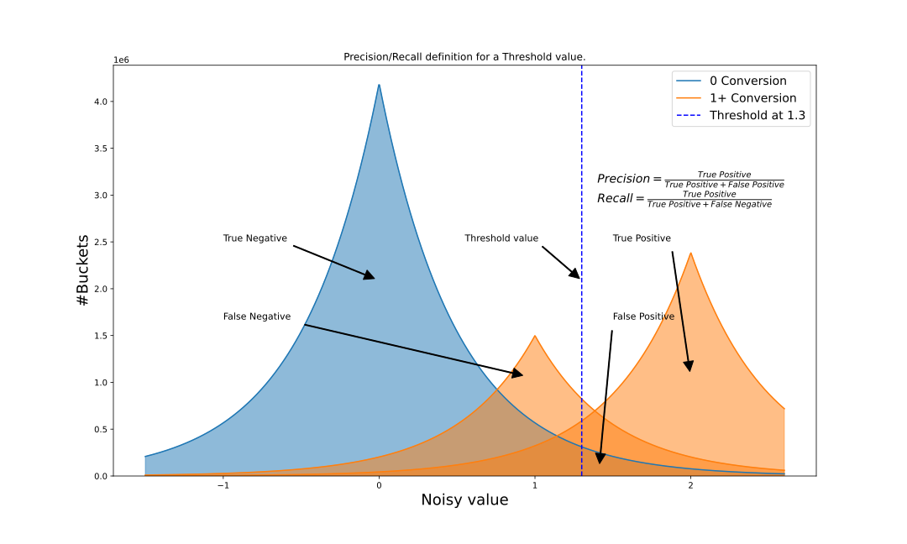

# Summary reports with key discovery

## Authors

* Charlie Harrison (csharrison@chromium.org)
* Hidayet Aksu (aksu@google.com)
  

## Introduction
This document describes possible new functionality in the server-side mechanisms for the aggregation service, which allows ad techs to query the Attribution Reporting API’s and Private Aggregation API’s summary reports without [pre-declaring every aggregation bucket](https://github.com/WICG/attribution-reporting-api/blob/main/AGGREGATION_SERVICE_TEE.md#pre-declaring-aggregation-buckets). 

This proposal is backward compatible; ad techs can still work with pre-declared buckets.

_Note: This document describes possible new functionality in the Aggregation Service. It is not necessarily a feature that will ship in the initial iterations of the API, but we are considering it as a largely backwards-compatible fast-follow. While this new functionality is being developed, we still highly encourage testing the existing API functionalities to support core utility and compatibility needs._


## Goals

The approach here is to provide ad techs flexibility to query the aggregation service:

* Allow querying reports when the list of buckets in the input are unknown or difficult to determine ([issue #583](https://github.com/WICG/attribution-reporting-api/issues/583), [cross-network attribution without redirects](https://developer.android.com/design-for-safety/privacy-sandbox/attribution#cross-network-attrib-without-redirects))
* Allow controlling output buckets (the buckets that are included in the summary reports that are returned by the aggregation service upon being queried) with a trade-off control threshold.


## Service changes

### Draw noise from the _truncated_ Laplace Distribution

The [aggregation service](https://github.com/WICG/attribution-reporting-api/blob/main/AGGREGATION_SERVICE_TEE.md) currently uses an [additive noise mechanism](https://en.wikipedia.org/wiki/Additive_noise_mechanisms) drawn from the Laplace distribution. We propose to replace the existing Laplace noise mechanism with a _[truncated Laplace noise mechanism](https://arxiv.org/pdf/1911.00602.pdf)_ with truncation point at ±`L1 + L1/epsilon*ln(1/delta)` throughout the entire aggregation service and for all queries. Please note that this is not a new mode, but rather a change to the entire existing mechanism. As before, noise is scaled based on the `L1` sensitivity, which is enforced by the client (known as contribution bounding) (`2^16`) and desired privacy parameters `epsilon` and a new parameter `delta`.


#### Pre-declaring aggregation buckets, key-mask, and threshold

The Attribution Reporting API and Private Aggregation API client describes a [128 bit key space](https://en.wikipedia.org/wiki/Key_size) for assigning _aggregation keys_, which are referred to as _buckets_ when associated with a value. This large space gives ad techs flexibility in how they define and use aggregated metrics. However, at this size, it's infeasible for the aggregation service to output a value for every possible bucket. To solve this, we are introducing new mechanisms to limit the output size. At query time, ad techs can:

* declare a set of buckets to be included in the output. This can be an empty set. This declaration matches the existing query option in the API.
* declare a key-mask that specifies the set of key bits ( e.g., `"0…0001111111111"` to represent the rightmost 10 bits of keyspace) that should be included in the output in addition to explicitly pre-declared buckets.
* set a threshold, so that only (non pre-declared) buckets with values exceeding the threshold are included in the output.
* supply multiple key masks with a threshold for each.

The algorithm for computing summary reports with this new mechanism is as follows:

* If a bucket is pre-declared — namely, if the ad tech explicitly requested it — it is always present in the output. If that bucket happens to not be present in any input aggregatable report, the aggregation service will still output a noised aggregated value (zero aggregated value + noise) for that bucket. Noise will be directly drawn from the statistical noise distribution mentioned [here](#bookmark=id.nat6mofklxgj).
* For any other (non pre-declared) bucket matching the key-mask provided by the ad tech:
    * first, noise is added to its aggregated value (the value being zero if the bucket is not present in any input aggregatable report)
    * then, the bucket is checked against the threshold the ad tech declared. The aggregation service will only include buckets in the output whose noisy values exceed that threshold. Note that this means some buckets may be present in the resulting summary report that have no associated real user contributions.

#### Precision/recall tradeoff

To ensure privacy, noise will be added to all requested buckets before thresholding, even if they are not part of the aggregatable reports. Therefore, buckets without any input may have non-zero values and appear similar to buckets that had input. Thus, a threshold will be chosen that minimizes the number of buckets in the output that are pure noise values (high precision) and maximizes the number of buckets with input (high recall).

The ad-tech-specified threshold works as a lever to control a trade off between the precision and recall of the output. 


_Fig 1: The chart shows two overlapping distributions, one in blue for false conversions (no user contribution) and one in orange for true conversions (have user contribution). Two distributions are divided by a threshold value, buckets that exceed the threshold (positive) are reported while the buckets that do not exceed the threshold (negative) are not reported in the output._

- **precision** is the proportion of buckets with true user contributions in the final output. 
- **recall** is the proportion of buckets with true user contributions that are correctly reported in the output (i.e. not dropped during thresholding) among all buckets with user contribution.

Both higher precision and higher recall are better, but they are inversely related. Ad tech can set thresholds for balancing precision/recall with each query. By default the threshold is set to a value that provides 100% precision (`L1 + L1/epsilon*ln(1/delta)`) though at that threshold value recall may be low, as the threshold is set to a relatively high value. Assuming the values of epsilon=10, delta=10^-8, and L1=2^16, then the threshold will be 186257 (2.84*L1) and expected recall will be ~82% for a [sample ads dataset](https://ailab.criteo.com/criteo-sponsored-search-conversion-log-dataset).


## Threshold selection

We intend to publish a tool which demonstrates the impact of threshold selection for precision/recall tradeoff. With this tool, we intend for ad techs to be able to:

* Explore the impact of threshold on various values of the key-mask, epsilon, and delta with simulated datasets.
* Find threshold values that satisfy their expectations.
* Learn the estimated output size for user-defined settings.


## Backward compatible API call

The key-mask is all zeros by default, so no extra keys will be discovered and the default threshold will never be triggered. This means that the output will only contain buckets that are in pre_declared_labels, which is similar to the legacy aggregate API call.

```python
def legacy_aggregate(aggregatable_reports, pre_declared_labels):
  return aggregate_with_key_discovery(aggregatable_reports, declared_labels)
```

Note: the truncated Laplace noise mechanism will apply to all API calls.


##  Example call with this new proposal

Assuming an ad tech uses the rightmost 42 bits of keyspace to encode attribution keys, and has found that a threshold of L1*2.5 provides a good precision/recall tradeoff for their use case. In this scenario, the ad tech's call to the aggregation service would look as follows:

```python
filtering_key_mask = [0]*(128-42) + [1]*42
threshold = 2.5*L1
noised_summary_report = aggregate_with_key_discovery(aggregatable_reports, pre_declared_labels, filtering_key_mask, threshold)
```


##  Future improvements 

* Along the lines of [issue 583](https://github.com/WICG/attribution-reporting-api/issues/583), consider allowing the browser to embed known values in the encrypted payload (e.g. the source site) to avoid needing a custom encoding.
* If the aggregation service supports re-querying (e.g. to address [issue 732](https://github.com/WICG/attribution-reporting-api/issues/732)), users of the aggregation service would be able to leverage this proposal to determine the relevant key space while consuming a low epsilon, and then query reports with higher epsilon to get less noisy results. 
