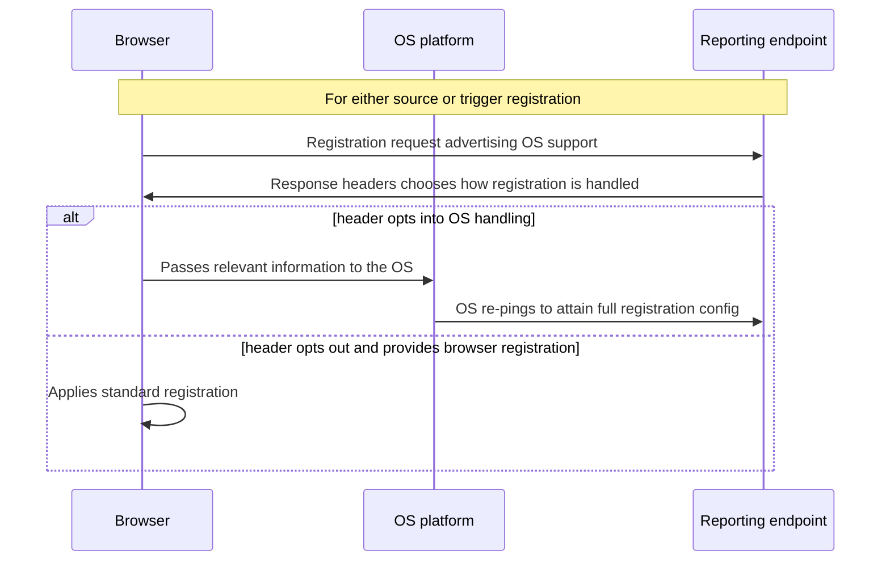

# Cross App and Web Attribution Measurement

## Authors
*   Arpana Hosabettu (arpanah@chromium.org)
*   Charlie Harrison (csharrison@chromium.org)
*   John Delaney (johnidel@chromium.org)
*   Michael Thiessen (mthiesse@google.com)

## Participate
See [Participate](https://github.com/WICG/conversion-measurement-api#participate).
Please file [GitHub issues](https://github.com/WICG/conversion-measurement-api/issues?q=is%3Aissue+is%3Aopen+label%3Aapp-to-web+) with the `app-to-web` label.


## Introduction

Currently, the [Attribution Reporting API](https://github.com/WICG/conversion-measurement-api) supports attributing events within a single browser instance. This proposal expands the scope of attribution to allow attributing conversions that happen on the web to events that happen off the browser, within other applications.

This proposal was inspired by Safari's [App-to-web support in Private Click Measurement](https://webkit.org/blog/11529/introducing-private-click-measurement-pcm/#:~:text=App-to-Web) and the [Android Privacy Sandbox](https://developer.android.com/design-for-safety/privacy-sandbox/attribution) proposal.

The proposal here takes advantage of OS-level support for attribution. In particular, it gives the developer an option to allow events on the mobile web to be joinable with events in [Android’s Privacy Sandbox](https://developer.android.com/design-for-safety/privacy-sandbox/attribution), although support for other platforms could also be implemented.

## Goals

*   Support measurement of ads that show up within apps that later convert on the web
*   Support measurement of ads that show up within the browser that later convert on the web or in an app / app install
*   Support both clicks and views
*   Proposal is generic enough to be implemented by any browser
*   While focusing initially on Android support, the proposal should be generic enough to be supported on other platforms

## API changes

See Android's [Attribution reporting: cross app and web measurement proposal](https://developer.android.com/design-for-safety/privacy-sandbox/attribution-app-to-web) for one example of an OS API that a browser can integrate with to do cross app and web measurement.

The existing API involves sending requests to the reporting origin to register events. These requests will have a new request header `Attribution-Reporting-Eligible`. On requests with this header, the browser will additionally broadcast possible web or OS-level support for attribution to the reporting origin's server via a new [dictionary structured request header](https://httpwg.org/specs/rfc8941.html#dictionary):
```
Attribution-Reporting-Support: os, web
```

Note that if there is neither web nor OS-level support for attribution, no
background requests will be made and the browser will not set
`Attribution-Reporting-Eligible` header on `<a>`, `window.open`, ``, or
`<script>` requests.

If the `Attribution-Reporting-Support` header indicates OS support, the reporting origin can optionally respond to the request with a [list structured header](https://httpwg.org/specs/rfc8941.html#list) containing one or more URLs that indicates a desire to use the OS's attribution API instead of the browser's. Note that the API also allows browsers to only support OS-level attribution if they choose.

Note: the `Attribution-Reporting-Support` header is subject to the browser adding
"GREASE" parameters, to ensure that servers use a spec-compliant structured
header parser. See [here](https://wicg.github.io/attribution-reporting-api/#example-a67a61e7)
for an example. For this header, only the structured-dictionary **keys** should
be interpreted: the values and parameters are currently unused, but may have
meaning in the future.

```http
// Registers a source against a native OS attribution API
Attribution-Reporting-Register-OS-Source: "https://adtech.example/register", "https://other-adtech.example/register"
```

Trigger registrations will accept a new response header as well:
```http
// Registers a trigger against a native OS attribution API
Attribution-Reporting-Register-OS-Trigger: "https://adtech.example/register", "https://other-adtech.example/register"
```

The reporting origin can also optionally respond with a [dictionary structured header](https://httpwg.org/specs/rfc8941.html#dictionary)
`Attribution-Reporting-Info` to specify the preferred platform. The key is
`preferred-platform` and the value is a [structured header
token](https://httpwg.org/specs/rfc8941.html#token)
with allowed values `os` and `web`.
```http
Attribution-Reporting-Info: preferred-platform=os
```

The browser will make the platform decision based on the availability of the
platform support on the user's device.

After receiving these headers, the browser will pass these URLs into the underlying OS API with any additional information including:
the context on which the event occurs (source / destination site)
the InputEvent in the event of a click/navigation source, for platform verification

Normal attribution logic in the browser will be halted.

For a site to enable App<->Web attribution after integrating with the Web API, they will only need to make server side changes.

A reporting origin responding with the `Attribution-Reporting-Register-OS-Source` or `Attribution-Reporting-Register-OS-Trigger` headers while there is no OS-level support will cause the OS registration to fail.
If both OS registration and web registration are provided in the response while
there is no OS-level support, the browser will fallback to the web registration
only if a preferred platform is specified. If a preferred platform is not
specified, then the web registration will fail as well.

## Optional: debugging reports

The Cross App and Web Attribution Measurement is new and fairly complex. A successful attribution requires both the
browser and OS-level support. As such, we are open to introducing a mechanism to
learn more debug information about OS registrations. This ensures that the API can be
better understood and help flush out any bugs (either in browser or OS or caller
code).

The reporting origins may opt in to receiving debugging reports by adding a new
boolean [parameter](https://httpwg.org/specs/rfc8941.html#param) `debug-reporting` to the
[items](https://httpwg.org/specs/rfc8941.html#item) in the
`Attribution-Reporting-Register-OS-Source` and
`Attribution-Reporting-Register-OS-Trigger` headers:

```http
Attribution-Reporting-Register-OS-Source: "https://adtech.example/register"; debug-reporting, "https://other-adtech.example/register"
```

```http
Attribution-Reporting-Register-OS-Trigger: "https://adtech.example/register", "https://other-adtech.example/register"; debug-reporting
```

The `debug-reporting` [parameter](https://httpwg.org/specs/rfc8941.html#param)
is set for each registration URL independently. When the OS registration is
successfully delegated to the OS, regardless of the native OS attribution API
result, the browser will send a non-credentialed HTTP POST
request to the registration URL's origin at the path
`/.well-known/attribution-reporting/debug/verbose`, e.g.
```
https://adtech.example/.well-known/attribution-reporting/debug/verbose
```

The report data is included in the request body as a JSON list of objects, e.g.:

```jsonc
[{
  "type": "os-source-delegated", // or "os-trigger-delegated"
  "body": {
    "context_site": "https://source.example",
    "registration_url": "https://adtech.example/register"
  }
}]
```

Note: The report body is a JSON list to align with the [verbose debugging reports](https://github.com/WICG/attribution-reporting-api/blob/main/EVENT.md#verbose-debugging-reports)
for the web-based Attribution Reporting API.

The reporting origins may also opt in to receiving header-error debugging
reports ([details](https://github.com/WICG/attribution-reporting-api/blob/main/EVENT.md#optional-header-error-debugging-reports)).

## Privacy considerations

This proposal explicitly links data from the web with data from apps. It enables apps to learn coarse user behavior patterns in the browser in the same way that the existing Attribution Reporting API allows websites to learn coarse user behavior patterns in the browser. In other words, we can safely think of an app as a particular "kind of website", and we can share data to apps that we’d be comfortable sharing to a (cross-site) website.

However, there are some “privacy budget” / rate-limit consequences to expanding support to the OS. In particular, if the OS maintains a separate budget than the browser, an adversary could in theory consume both the browser-local budget and the OS system budget, leaking more than if only the browser-local budget were used. Mitigations for this issue include stricter budgets overall, or being more restrictive about entities that can register both OS-level events and browser-local events.

Additionally, this proposal sends user information from the browser to the operating system. The OS will be responsible for integrating with browser user controls such as those for clearing browsing history.

### New fingerprint vector
The new request header we would add to the API, `Attribution-Reporting-Support` adds an additional fingerprinting vector letting an adversary know if the underlying platform supports attribution reporting.

### User Control
Attribution between two websites within the browser doesn't require specific OS support. However, attribution of web to app or app to web will require (1) that a user's device supports both a valid version of the browser and a valid version of the operating system and (2) that the user has not disabled the Attribution Reporting API for either the browser or the platform. If the user has opted out of the API in either the browser or at the OS level, app to web or web to app attribution will not be enabled.

## Security considerations

This design places trust in the OS to process potentially sensitive user data. Additionally, it requires the OS to place trust in the browser.

Further discussion on the Android-specific measurement API's security considerations can be [found here](https://developer.android.com/design-for-safety/privacy-sandbox/attribution-app-to-web#apps-privacy-security).

# Appendix
## Alternative design considered: Sending app events directly to browsers

A previous iteration of this design involved sending app events to “the browser” using Android Intents. This design was not ideal due to scalability issues when there were multiple browsers on a user’s device, since it put the singular browser in the center of attribution, in control of everything. If there were multiple browsers, an app would be forced to send things like view Intents to all the registered browsers on the device at once.

With platform-level support, this kind of architecture is not necessary.

## References & acknowledgements

Apple has announced a [similar feature](https://webkit.org/blog/11529/introducing-private-click-measurement-pcm/#:~:text=App-to-Web) to support conversions within Safari to be attributed to app clicks on iOS.
