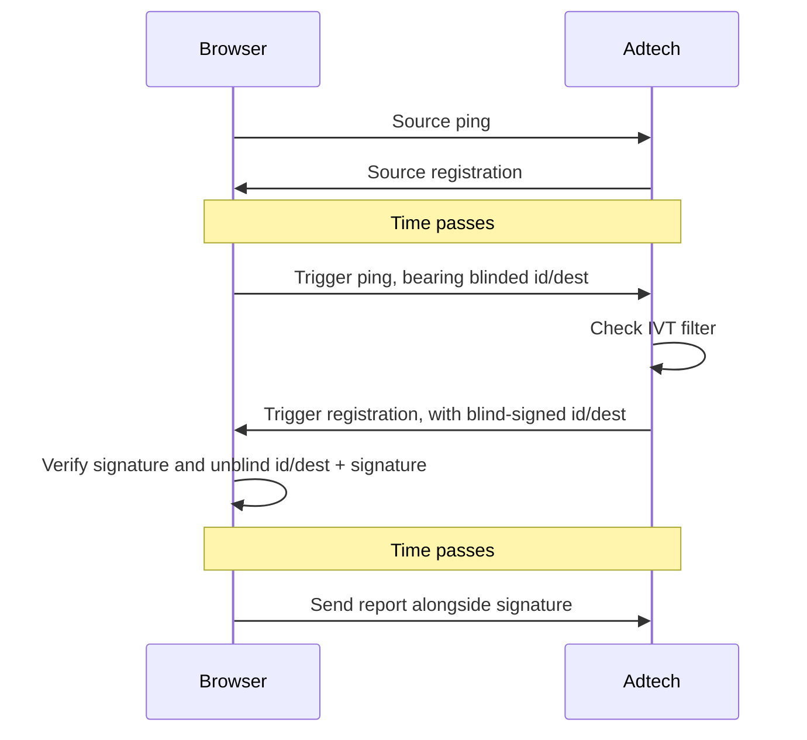

# Preventing invalid aggregatable reports via report verification

<!-- START doctoc generated TOC please keep comment here to allow auto update -->
<!-- DON'T EDIT THIS SECTION, INSTEAD RE-RUN doctoc TO UPDATE -->
**Table of Contents**

- [Security goals](#security-goals)
  - [Existing mitigations and practical threats](#existing-mitigations-and-practical-threats)
- [Blind signatures overview](#blind-signatures-overview)
- [Reporting origin opt-in](#reporting-origin-opt-in)
- [API changes](#api-changes)
  - [Issuance](#issuance)
  - [Redemption](#redemption)
- [Privacy considerations](#privacy-considerations)
- [Security considerations](#security-considerations)
  - [No reports out of thin air](#no-reports-out-of-thin-air)
  - [No replaying reports](#no-replaying-reports)
  - [Privacy of the IVT detector](#privacy-of-the-ivt-detector)
  - [Limit the attack scope for bad actors that can bypass IVT detectors](#limit-the-attack-scope-for-bad-actors-that-can-bypass-ivt-detectors)
  - [No report mutation](#no-report-mutation)
- [Future Extension: scalable public metadata for destination verification](#future-extension-scalable-public-metadata-for-destination-verification)
- [FAQ](#faq)
  - [Why doesn’t this support issuance at source registration time?](#why-doesnt-this-support-issuance-at-source-registration-time)
  - [Why doesn’t this support event-level reports?](#why-doesnt-this-support-event-level-reports)
  - [Why deviate from the Private Click Measurement approach?](#why-deviate-from-the-private-click-measurement-approach)
  - [Could we just tag reports with a trigger_id instead of using anonymous tokens?](#could-we-just-tag-reports-with-a-trigger_id-instead-of-using-anonymous-tokens)
  - [How can I compose this with other trust signals?](#how-can-i-compose-this-with-other-trust-signals)
    - [Basic Private State Tokens](#basic-private-state-tokens)
    - [Custom trust signal](#custom-trust-signal)
  - [How should this work with cross app and web integration?](#how-should-this-work-with-cross-app-and-web-integration)

<!-- END doctoc generated TOC please keep comment here to allow auto update -->

This document describes a basic integration between the [Attribution Reporting
API](https://github.com/WICG/attribution-reporting-api) and [Private State
Tokens](https://github.com/WICG/trust-token-api) API, focused on aggregatable
reports. The purpose of this integration is to enhance the security of the
aggregatable reports by making it more difficult for bad actors to interfere
with the accuracy of attribution measurement. This integration is possible via a
new flow where reporting origins can submit private tokens attesting to the
veracity of a trigger registration.

Note: many of the ideas in this document are also compatible with the [Private
Aggregation
API](https://github.com/patcg-individual-drafts/private-aggregation-api).


## Security goals

The primary security goal of this proposal is to prevent a class of attacks on
forging fake aggregatable reports, for [reporting
origins](https://github.com/WICG/attribution-reporting-api/blob/main/EVENT.md#:~:text=s%20origin%20the%20%22-,reporting%20origin,-%22%20since%20it%20is)
that opt into the feature. The attacker we are concerned about is a party
attempting to falsify reports, to corrupt aggregate measurement.

Our security goals for this proposal are as follows:

- **No reports out of thin air**: It should not be possible for an attacker
   to generate fake reports out of thin air.

- **No replaying reports**: It should not be possible for an attacker to
   replay one honest report multiple times, if they can exfiltrate an honest
   report.

We also have a few secondary goals we’d hope the solution achieves:

- **Privacy of the invalid traffic (IVT) detector**: Ideally, a client
   should not be able to use the output of this system to learn anything about
   the reporting origin’s invalid traffic detector (and therefore, learn how to
   bypass it more easily). In other words, the output of the IVT detector should
   be private to the client.

- **Limit the attack scope for bad actors that can bypass IVT detectors**:
   The proposal leverages existing IVT detectors operated by the reporting
   endpoint. Any proposal should attempt to limit the attack scope even for
   adversaries that can craft requests to bypass detection.

- **No report mutation**: It should not be possible for an attacker to
   mutate reports arbitrarily after they are generated by an honest client. Note
   this is only P2 because the API only works over HTTPS, so mutating reports
   from an honest client requires a very specific attacker with access to
   infrastructure owned by the reporting origin (or something like "read-only"
   malicious client malware).


### Existing mitigations and practical threats

**"No reports out of thin air"** is not currently prevented in the API, without
the proposal in this document. However, practical attacks on the system are
challenging, as they require an adversary to have a deep understanding of the
reporting origin’s key space in order to alter aggregate results. A much more
practical attack is one closer to replaying honest reports, since it is
fairly easy for an adversary to learn a set of honest reports via instrumented
web browsing, and to replicate them.

## Blind signatures overview

At a high level, [Private State
Tokens](https://developer.chrome.com/docs/privacy-sandbox/trust-tokens/)
implements a [blind
signature](https://en.wikipedia.org/wiki/Blind_signature)-style operation:

```
BlindMessage := Blind(message)

BlindSignature := Sign(blindedMessage)

ClearSignature := Unblind(blindSignature)

Verify(message, ClearSignature) => boolean
```

In this document, we use the following terms:
* **Blinded token**: Equivalent to the `BlindMessage`
* **Token**: Equivalent to the `(message, ClearSignature)` pair

For simplicity, this omits the [public/private
metadata](https://github.com/WICG/trust-token-api#extension-public-metadata)
aspects of Private State Tokens which extend this basic primitive.


## Reporting origin opt-in

In order for a reporting origin to use this feature, they must configure
themselves as a Private State Token issuer, by publishing key commitments
publicly (see [issue 117](https://github.com/WICG/trust-token-api/issues/117) on
the Private State Token repo, as this process is still being finalized).


## API changes



### Issuance

The token issuance protocol can only happen on [trigger
registration](https://github.com/WICG/attribution-reporting-api/blob/main/AGGREGATE.md#attribution-trigger-registration).
For reporting origins that are configured to do Private State Token issuance,
all new requests that have the `Attribution-Reporting-Eligible` request header
with the `trigger` value will automatically attach a
`Sec-Attribution-Reporting-Private-State-Token` header with a comma-separated
list of blinded messages (which embeds the concatenation of the `report_id` and
`attribution_destination`).

The reporting origin will inspect the request and decide whether it is valid,
i.e. whether the origin suspects it is coming from a real, honest client and
should therefore be allowed to generate attribution reports.

*   If the request is considered **invalid** and hence shouldn’t be taken into
    account to calculate aggregate measurement results, the reporting origin
    should respond without adding a
    `Sec-Attribution-Reporting-Private-State-Token` response header. If this
    header is omitted or is not valid, the browser will proceed with trigger
    registration normally, but any report generated will not contain the
    verification header. Note: more advanced cases deployments can consider
    issuing an "invalid" token using private metadata to avoid the client
    learning the detection result. See
    [privacy of the IVT detector](#privacy-of-the-ivt-detector) for more details.
*   If the request is considered **valid**, the reporting origin should add a
    `Sec-Attribution-Reporting-Private-State-Token` header with blind tokens
    (the blind signatures over the blinded messages).

Internally, the browser will randomly associate the tokens with any reports
generated from this trigger request, including [null reports](https://github.com/WICG/attribution-reporting-api/blob/main/AGGREGATE.md#hide-the-true-number-of-attribution-reports).

Note: because we only support issuance requests on requests bearing the
`Attribution-Reporting-Eligible` header, some trigger requests flows are not
supported due to [issue
#347](https://github.com/WICG/attribution-reporting-api/issues/347). Supporting
those flows would require performing the issuance protocol on almost every
resource request on the web.


### Redemption

Any tokens  associated with an attribution report will be sent along with the
report’s request in the form of a new request header
`Sec-Attribution-Reporting-Private-State-Token`. If this token successfully
verifies, then the reporting origin has a guarantee that the report was
associated with a previous trigger request that was signed.

Note: unlike the basic Private State Token API (which enables conveying tokens
from one site to another), there are no redemption limits for Attribution
Reporting API integration. See 
[privacy considerations](#privacy-considerations) for more information.


## Privacy considerations

The privacy goal of this integration is to be as privacy-neutral as possible.
For this, we want to ensure that token integration doesn’t add any cross-site
information leakage to the API. In particular, the worry here is that the
encrypted reports can be partitioned by extra data that the tokens (or lack
thereof) communicate across sites. If the _count_ of encrypted records is
sensitive, then partitioning this count per token-state (trigger-side data)
could amplify a counting attack.

Even without report verification, reports can already be partitioned by the
following trigger-side fields:

- `scheduled_report_time`
- `attribution_destination`

Additionally the designs to [protect the number of encrypted
reports](https://github.com/WICG/attribution-reporting-api/blob/main/AGGREGATE.md#hide-the-true-number-of-attribution-reports)
attempt to neutralize the privacy harm that is possible by counting encrypted
reports. At the most extreme end we can make the count of encrypted records
totally public knowledge, which makes even [arbitrary partitioning privacy
neutral](#could-we-just-tag-reports-with-a-trigger_id-instead-of-using-anonymous-tokens).
However, with less extreme techniques there are privacy benefits to reducing the
partitioning available.

For this reason, partitioning mitigations will not be implemented and the basic
Private State Token protocol will be allowed with no extra restrictions. This
allows the reporting origin to partition encrypted reports based on the
following information:

- Presence or absence of a token on a report leaking information about a
  conversion.

- "Public/private metadata" (in the form of which public key is used to sign the
  token) leaking non-noisy information. Currently, the Private State Tokens API
  allows [six
  buckets](https://github.com/WICG/trust-token-api/blob/main/ISSUER_PROTOCOL.md#issuance-metadata)
  of metadata.

While we don’t currently plan to mitigate against this partitioning, it could in
theory be mitigated by the following techniques:

- The browser could refuse to register conversions for triggers which did not
  come with an issued token.

- The browser could accept token issuance from only a single key at a time (and
  forbid private metadata). Note that this conflicts with the security goal of
  IVT detector privacy.


## Security considerations

Evaluating the top level security goals:

### No reports out of thin air
This is addressed because any report created out of thin air and sent to the
ad-tech will need to be associated with a token. Any report not associated with
a token can be immediately discarded as invalid. Tokens cannot be generated "out
of thin air", because receiving one requires an
interaction with the reporting origin.

### No replaying reports
This is addressed because every report will come with a token bound to its
`report_id`. Reporting origins can easily protect themselves from replays by
keeping track of which IDs they have already seen (something we already
recommend due to browser retries).

### Privacy of the IVT detector
This is addressed via supporting the existing Private State Token's notion of
[Private metadata](https://github.com/WICG/trust-token-api#extension-private-metadata).
Reporting origins may not wish to reveal to clients (who could be potential
attackers) the signal of whether the report was deemed invalid or not, since
this exposes information about the reporting origin's potentially secret logic.
Private metadata solves this problem by embedding information that is only
readable to the reporting origin that the client can merely read the cardinality
of (e.g. that the information is just 1 bit). A reporting origin wishing to hide
information about its IVT detector can simply issue tokens unconditionally, and
embed the IVT decision in the private metadata bit.

### Limit the attack scope for bad actors that can bypass IVT detectors
This is not addressed in this proposal, but we are exploring  [future
extensions](#future-extension-scalable-public-metadata-for-destination-verification)
to address it.

### No report mutation
This is only partially addressed via binding the issued token to the report’s
`report_id` and `attribution_destination`. This means that tokens are not
"fungible" and could only be used with a report with those matching properties.
Note that it may be possible to ensure total immutability of a report (by
signing over the whole generated report), but it naturally implies that we’d
need to add another round of interaction between client and reporting origin,
which may not be worth the extra complexity to support this.

Note that because we expect reporting origins to already deduplicate based on
`report_id`, this infrastructure should neatly work to handle the "double
spend" problem where attackers attempt to use tokens multiple times.

## Future Extension: scalable public metadata for destination verification

Currently, Private State Tokens supports a notion of "public metadata" that
corresponds essentially to which signing key is used to generate a blind token.
This is difficult to scale for large domains like all possible destination
sites, but we can consider adopting cryptographic extensions (e.g.
[1](https://eprint.iacr.org/2021/203.pdf),
[2](https://eprint.iacr.org/2021/864.pdf)) which support signing over some
public domain (e.g. sites).

Essentially, we can allow the token issuance operation to receive and sign over
the destination site in cleartext instead of blind signing. This does not
regress privacy, but would protect against a malicious client that is forging
blinded tokens that intentionally falsify the destination site.

This allows us to support the **"Limit the attack scope for bad actors that can
bypass IVT detectors"** goal, because a bad actor that can bypass an IVT detector
but does not actually trigger any third party conversions can only submit
reports constrained by which destination site they actually advertised when they
were issued tokens.


## FAQ

### Why doesn’t this support issuance at source registration time?

The proposed designs for [protecting encrypted record
counts](https://github.com/WICG/attribution-reporting-api/blob/main/AGGREGATE.md#hide-the-true-number-of-attribution-reports)
prevent us from sending data from the client that reveals non-noisy cross-site
data. They do this by allowing the browser to send "null" reports that don’t
affect aggregate output at all. If we introduce a mechanism where a report can
attest to being part of a valid source and trigger, it prevents the browser from
being able to send these null reports.

This constrains us to two solutions:

1. Attested sources can send null reports (with the associated source token)
   proportional to the number of sources.
1. Attested triggers and send null reports (with the associated trigger token)
   proportional to the number of triggers

This design chooses (2) because:

- We expect triggers to have more IVT signals (i.e. they can often be
  accompanied by verifiable user actions like purchases)
- We expect the volume of triggers to be less than sources, which helps with
  system health of the API


### Why doesn’t this support event-level reports?

The reason is very similar to why this proposal doesn’t support
[issuance at source registration time](#why-doesnt-this-support-issuance-at-source-registration-time).
Event-level reports are subject to browser randomization in which the browser
needs to be free to create fake triggers. This means that we couldn’t possibly
provide verification for triggers as it breaks the privacy mechanism. It is
possible to attest sources, but because event-level reports already have a high
entropy (hard to guess) ID associated with it, the added benefit of tokens is
minimal.

### Why deviate from the Private Click Measurement approach?

Private Click Measurement (PCM) supports a [similar
design](https://webkit.org/blog/12566/private-click-measurement-conversion-fraud-prevention-and-replacement-for-tracking-pixels),
where source and trigger registration support adding an optional nonce, which is
signed via an interaction with the server. For the privacy reasons [described
above](#why-doesnt-this-support-issuance-at-source-registration-time), we can’t
align with PCM on source signing.

For trigger signing, our approaches are broadly compatible, except that

*   PCM does all configuration via query parameters in a (blocked) redirect and
    we do everything in headers. This is necessary for us because we support
    additional registrations with real redirects.
*   PCM puts the resulting unlinkable token in the body of a report, while we
    propose to do it in a separate header. This is mostly to align with our
    header issuance protocol to keep things consistent.
*   PCM uses
    [RSABSSA](https://www.ietf.org/archive/id/draft-irtf-cfrg-rsa-blind-signatures-01.html)
    while this proposal uses [Private State
    Tokens](https://github.com/WICG/trust-token-api) / [Privacy
    Pass](https://www.ietf.org/archive/id/draft-ietf-privacypass-architecture-06.html)
    for underlying crypto operations which sits one layer higher in the stack.
    Notably, Privacy Pass internally uses RSABSSA. Integrating with Private
    State Tokens allows us to re-use its key commitment infrastructure.

Other than that the designs are very similar.

### Could we just tag reports with a trigger_id instead of using anonymous tokens?

In principle, we could abandon the token-based approach and tag every report
with an unencrypted high-entropy identifier that is configured at trigger time.
This would uniquely tie every encrypted report with the trigger context that
generated it. Because the ids are high entropy (and thus difficult to guess),
they could serve the purpose of the anonymous tokens and additionally allow for
offline filtering of reports (i.e. deferring the IVT decision until after
trigger registration).

This will allow a reporting origin to partition encrypted reports on a
per-advertiser-user basis, which means that in order to make this idea privacy
neutral, we’d need to fully protect the counts of encrypted reports e.g. by
unconditionally sending aggregatable reports on every trigger registration (even
when there is no corresponding source), ensuring that the encrypted payloads
reveal no cross-site information. See issue #439 for more details. We are not
proceeding with this option currently due to performance concerns (bandwidth,
compute) with sending lots of null reports.

Note that this approach would also mean we could likely remove some/all of the
delay in aggregatable reports.

### How can I compose this with other trust signals?

This API allows the reporting origin to make a token issuance decision based on
the information embedded in the trigger registration request. To aid in this
decision it’s expected that the request will come bearing some _context_ that
will help the origin make this decision, and the proposal is extensible to
support adding many forms of context in the registration request. Here are two
examples:

#### Basic Private State Tokens

When making an "IVT" decision on trigger registration requests, it may be useful
to have the extra trust signals from basic Private State Tokens. In many cases
it should be straightforward to ensure that trigger registration requests come
bearing Private State Tokens:

```javascript
window.fetch('https://adtech.example/trigger-attribution?convid=123', {
  attributionReporting: { triggerEligible: true },
  keepalive: true,
  privateToken: {
    operation: 'send-redemption-record',
    issuers: ['https://invalid-detection.example/'],
  },
});
```

#### Custom trust signal

Any other custom trust signals available can be used as an input into the token
issuance protocol. The only requirement is that the signal is exposed in the
network request that is used to trigger attribution. Note that if the request
comes bearing a cookie, the cookie can also be used as input into the issuance
protocol.

```javascript
const trustSignal = generateTrustSignal();
window.fetch(`https://adtech.example/trigger-attribution?convid=123?trustSignal=${trustSignal}`, {
  attributionReporting: { triggerEligible: true },
  keepalive: true,
});
```

### How should this work with cross app and web integration?

Our designs for [cross app and web
measurement](https://github.com/WICG/attribution-reporting-api/blob/main/app_to_web.md)
allow routing attribution to the underlying platform. Therefore, to support this
kind of token-based verification in that setting would require the underlying
platform to support this design.
